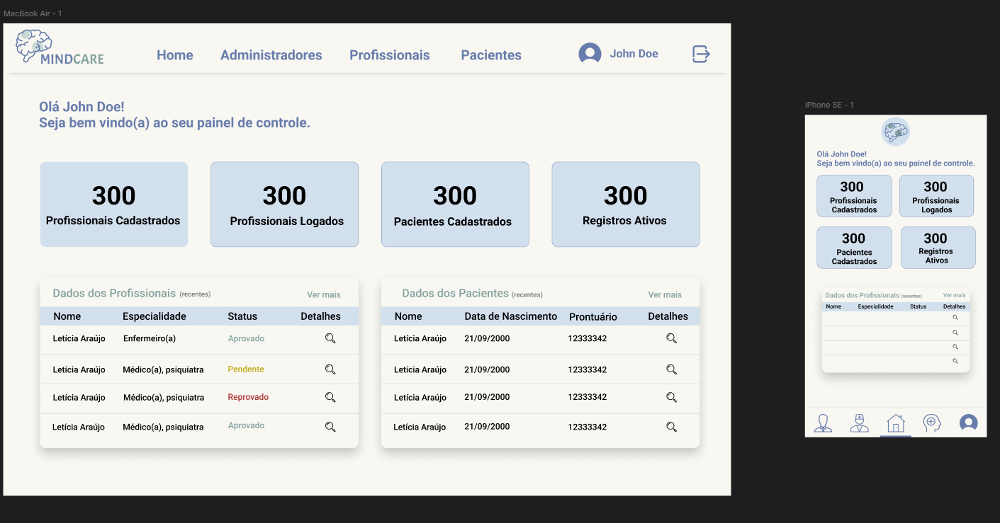
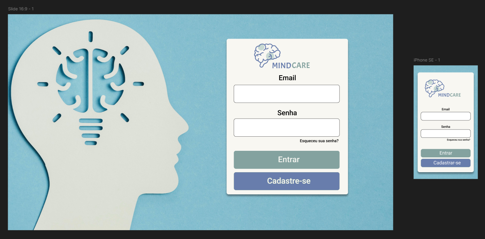

# MindCare

Bem-vindo ao projeto **MindCare**! Este repositório contém todas as informações necessárias para o desenvolvimento do sistema, incluindo critérios de aceitação, requisitos e instruções para a implementação.

## Documentação

### Critérios de Aceitação e Requisitos

Os critérios de aceite e requisitos de funcionamento do sistema para cada tipo de usuário estão detalhados na documentação oficial. Consulte o arquivo [user_stories.md](https://github.com/pedrolucazx/mindcare/blob/main/documentation/user_stories.md).

> **Importante:** O comportamento das telas e componentes deve seguir o que está especificado nesse documento.

### Layout

O layout do sistema está disponível no Figma e serve como guia visual para o desenvolvimento.

- Link do Figma: [MindCare Design](https://www.figma.com/design/BK3g9RH1n8fOXAL2njI2PQ/MindCare?node-id=1-2&p=f&t=voWU4VrxyXXE1fhm-0)
- Até o momento, estão disponíveis:
  - Tela inicial do administrador master (versão mobile e desktop).
    
  - Tela de Login (versão mobile e desktop).
    
  - Tela de Admin (versão mobile e desktop).
    
